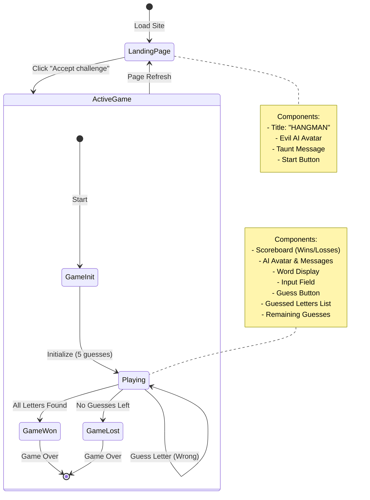
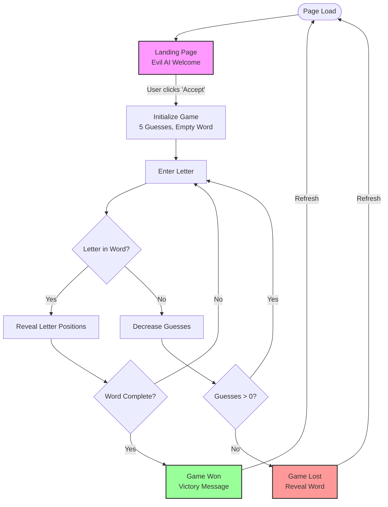

# Evil AI Hangman Game - Sitemap

## URL Structure
Base URL: `https://project-evil-ai-hangman-game-667.magicpatterns.app/`

## Site Map

### 1. Home / Landing Page (`/`)
- **Initial State (Pre-game)**
  - Title: "HANGMAN"
  - Evil AI character with avatar
  - Welcome/Taunt message from Evil AI
  - Call-to-action button: "Accept your challenge" or "Come on, let's play"
  
### 2. Game State (`/` - Same URL, different states)

#### 2.1 Active Game State
- **Header Section**
  - Scoreboard:
    - Wins counter (top left)
    - "HANGMAN" title (center)
    - Losses counter (top right)
  
- **AI Character Section**
  - Evil AI avatar
  - Dynamic taunting messages based on game progress
  
- **Game Board**
  - Guesses remaining counter
  - Word display with underscores/revealed letters
  - Letter input field
  - "Guess" button (disabled until letter entered)
  - Guessed letters display section
  
#### 2.2 Game Over State - Loss
- Same layout as active game
- Final taunt message revealing the word
- Guesses left: 0
- Input disabled
- Refresh page to play again

#### 2.3 Game Over State - Win
- Same layout as active game  
- Victory acknowledgment message
- Complete word revealed
- Input disabled
- Refresh page to play again

## Game Flow

1. **Landing** → User clicks "Accept your challenge"/"Come on, let's play"
2. **Game Start** → Initialize with 5 guesses, empty word slots
3. **Gameplay Loop** → User enters letters, receives feedback
4. **Game End** → Win or Loss state with final message
5. **Reset** → Page refresh returns to landing state

## Interactive Elements

- **Buttons**
  - Start game button (landing page)
  - Guess button (during game)
  
- **Input Fields**  
  - Letter input textbox (single character)
  
- **Dynamic Content**
  - AI messages (changes based on game events)
  - Word display (reveals letters as guessed)
  - Guessed letters list (updates with each guess)
  - Counters (wins, losses, guesses remaining)

## Technical Notes

- Single Page Application (SPA)
- All game states handled on same URL path
- No additional pages or routes
- Game state managed client-side
- Refresh resets to initial landing state

## Mermaid Diagram

